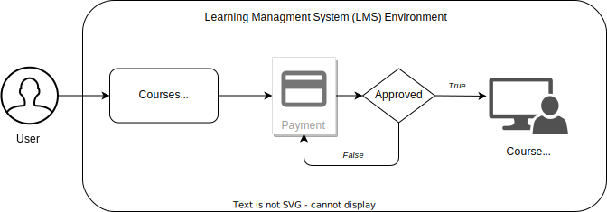

# **Overview**

## **Introduction**
This is a project where a company, besides other services, created and provided specialized courses in an e-Learning platform for their target public. But in a moment in the past, they realized that they needed more than just a platform that provided courses. They wanted to have a platform that could track their student's progress, offer conclusion certificates, and other features that an e-Learning platform couldn't provide. So they decided to migrate to an LMS (Learning Management System), but at the same time, they still wanted to stick with the e-Learning platform to showcase the courses catalogs and the payment system.

#### **Previous Architecture**

#### **New Architecture**

#### **Overview**
In this new architecture, we have detached the LMS from the payment system. The LMS and the payment system are now standalone services independent of each other. We could go even further by detaching the course catalog, and then we would have 3 independent systems. 

> **_Note:_** By saying payment system, actually, I'm referring to the old LMS that provided the course catalog, the LMS itself, and the payment system. But I pointed as a payment system because we can now use any payment system as we want and attach it to the new LMS.

## **Objective**
Set up an integration between the new LMS and the old e-Learning platform, so that they could communicate with each other without any impact on the clients/students as well providing a better learning environment for the students.

## **Tech Stack**
We're going to use Google Cloud to build up this integration. So we need a NoSQL database to store the student data as expiration time, 

|  | GCP Stack  | 
| --- | --- |
|  | Google Firestore |
|  | Google Cloud Function |
|  | Google Cloud Pub/Sub |

- Webhook