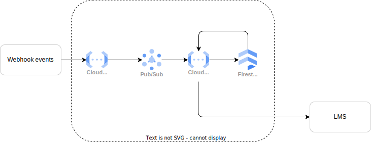

# **Integration between a Payment System and an LMS - A real-time solution using GCP**

## **Overview**
This is a real-world project where a client wanted to change their e-Learning platform to an LMS (Learning Management System). In general, e-Learning and LMS have the same purpose: to offer an environment to place course content (videos, audio, text, etc.), but the LMS has some extra resources, like gamification and so on. So they wanted me to integrate these two platforms, where the LMS will be the new course content platform, and the e-Learning platform will act as the payment system and the course catalog.

> So, the idea here is to create a fictitious scenario based on this real-world project, where a client will allow us to use GCP (Google Cloud Platform) to integrate these two platforms, which should be real-time and create a relational database using BigQuery to feed a dashboard to track revenue. We're going to work with these skills in this project: 
> - Cloud Architect: By designing the architecture of the integration using GCP
> - Data Engineer: By implementing the architecture designed, set up a NoSQL database and a data warehouse and works with the streaming data
> - Data Analyst: By creating a dashboard to track the revenue of the courses

## **Tech Stack**
Here are some of the frameworks that we will use in this project:

|  | Framework  | Description |
| --- | --- | --- |
| <picture></picture> | Google Firestore | NoSQL database |
| <picture></picture> | Google Cloud Function | Endpoint for webhooks \| Security lawyer for data delivery |
| <picture></picture> | Google Pub/Sub | Message queue to guarantee proper delivery |
| <picture></picture> | BigQuery | Relational database |
| <picture></picture> | Cloud Composer | Fully manage Airflow Environment in GCP  |
| <picture></picture> | Webhooks    | Real-time event delivery
| <picture></picture> | FastAPI    | To create the API that will allow end-users to manipulate the courses link between the two platforms
| <picture></picture> | Airflow    | Data orchestration framework that will be used to run scheduled checks the  expiration date of the courses as well update the revenue in the BigQuery 

## **Context**
A company, besides other services, creates and provides specialized courses in an e-Learning platform for their target public. But now, they realize they need more than just a platform that provides lessons. They want a platform to track students' progress, offer conclusion certificates, and other features that an e-Learning platform can't provide. 

So they decided to migrate to an LMS (Learning Management System) but, at the same time, they still want to stick with their e-Learning platform to showcase the courses catalogs and to make this platform work as their payment system, meaning that we have to create and integration that should be real-time, where the client's buys in one platform and it should reflect in the other platform immediately.

The client uses GCP as their cloud provider for their other services, and they said that we could create any solution using GCP that will be benefited from using this cloud provider.

### Platforms used
- **e-Learning platform**: Hotmart (https://www.hotmart.com/)
- **LMS**: Talent LMS (https://www.talentlms.com/)

## **Objective**
Set up an integration between the new LMS and the old e-Learning platform so that they could communicate with each other in real-time without causing any impact on the clients/students, create a relational database to track the revenue of courses that will feed a dashboard, and maintain in recurrence payment courses only the students that are paying in time.

## **Introduction**

The e-Learning platform works as 3 systems integrated seamlessly: course catalogs, payment system, and course contents (Figure 1). In other words, what this client wants is that we detach the payment system and courses catalog from the content of the courses, as shown in Figure 2. 

<picture>
    <source srcset="./img/hotmart_architecture.drawio.svg" type="image/svg+xml">
    
</picture>
     
        Figure 1: How the 3 systems are integrated seemslessly in the e-Learning platform (Hotmart)
    

  

<picture>
    <source srcset="./img/detached_architecture.drawio.svg" type="image/svg+xml">
    
</picture>
     
        Figure 2: How the systems will be detached from each other in the new architecture
    

  

As the company is willing to activate new students through the payments made in the e-Learning platform, first of all, we need to understand how these 2 platforms can communicate with each other. Well, the e-Learning platform has a webhook that we can use to send the data to the LMS every time an event occurs (https://developers.hotmart.com/docs/en/1.0.0/webhook/using-webhook/), so we are going to use that. 

Then, we need to check if the LMS has an open API so that we can create or update the student statuses with the information provided by the webhook. And it has one (https://www.talentlms.com/pages/docs/TalentLMS-API-Documentation.pdf), so we will use that.

By now, knowing that the platforms have ways to communicate with each other, we can start to think about the architecture of the integration. As we will not care about the active students, we will consider that all the active students were migrated, so we don't need to worry about this migration scenario. Let's see how we can design the architecture of this integration.

## **Architecture**

<picture>
    <source srcset="./img/integration_architecture.drawio.svg" type="image/svg+xml">
    
</picture>
     
        Figure 2: How the systems will be detached from each other in the new architecture
    

  

## **Business Considerations**

Let's now think about the business rules. If the client only sells lifetime access courses, we finish our work here and just need to start the implementation. But if the client sells courses with a recurrence payment, we need to consider that the student should only have access to the course if they pay on time. So we must check if the student pays on time, and we can do that with the help of the webhook events. Or another scenario, where the course has not lifetime access, we need to block the student after a stipulated period.
